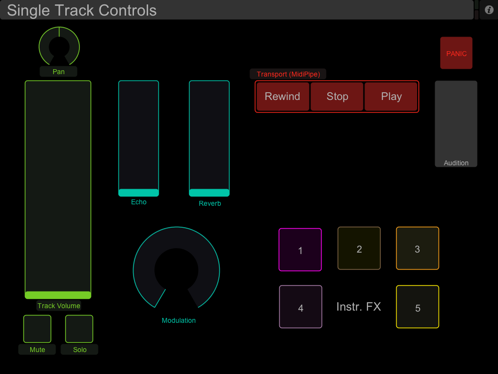
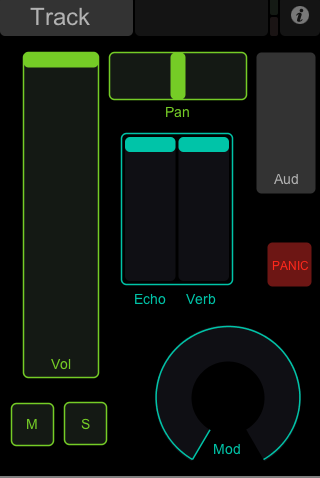
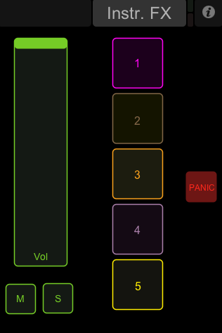

# README

[GarageBand](http://www.apple.com/ilife/garageband/) + [TouchOSC](http://hexler.net/software/touchosc) gbControl version 0.1 (toss n' go)

**License:** Please distribute. Please improve. Credit me if you fork and/or distribute. Above all, distribute and improve on this template ([CC-BY](http://creativecommons.org/licenses/by/3.0/)).

Quick TouchOSC template put together for a friend to control a single GarageBand channel at a time. For transport control, install [MIDIPipes](http://subtlesoft.square7.net/SubtleSoft/MidiPipe.html) and use the provided *.mipi file.

Thanks, – gb

---

